# 🚇 kube-tunnel

> A high-performance Kubernetes service proxy with intelligent protocol detection and automatic service discovery

[](https://golang.org/)
[](LICENSE)
[](https://github.com/snakeice/kube-tunnel/pulls)

Transform how you access Kubernetes services with DNS-style routing and zero-config port forwarding. No more manual `kubectl port-forward` commands—just use standard HTTP clients with Kubernetes service names.

## ✨ Features

- 🚀 **Multi-Protocol Support** — HTTP/1.1, HTTP/2 (h2/h2c) and gRPC on a single port
- ⚡ **Auto Port-Forwarding** — Automatic, cached port-forwards to healthy pods
- 🌐 **Virtual DNS Interface** — Isolated DNS mode to avoid VPN/hosts conflicts
- 🏠 **Free Local IP** — Smart allocation (127.0.0.2+) to prevent localhost collisions
- � **Universal Port Handling** — Handle ALL ports on virtual interface with intelligent port matching
- �📊 **Health Monitoring** — Lightweight monitoring with Prometheus metrics
- 🔧 **Zero Configuration** — Works out-of-the-box with sensible defaults

## 🚀 Quick Start

### Installation

```bash
git clone https://github.com/snakeice/kube-tunnel
cd kube-tunnel
go build -o kube-tunnel ./cmd
```

### Basic Usage

1. **Start the proxy** (auto-configures DNS):

```bash
./kube-tunnel
```

1. **Start with common options**:

```bash
# Enable debug logging
./kube-tunnel -verbose

# Use virtual interface mode for enhanced port handling
./kube-tunnel -virtual

# Custom port and virtual IP
./kube-tunnel -port=8080 -virtual -virtual-ip=10.8.0.1
```

1. **Access services** using Kubernetes DNS names:

```bash
# HTTP requests
curl http://my-service.default.svc.cluster.local/api

# gRPC calls
grpcurl api.default.svc.cluster.local:80 list

# HTTPS (with self-signed certs)
curl -k https://secure-service.default.svc.cluster.local/health
```

### 🔌 Enhanced Port Handling

With virtual interface enabled, you can access services on **ANY port**:

```bash
# Enable virtual interface (creates 10.8.0.1 by default)
KTUN_USE_VIRTUAL=true ./kube-tunnel

# Now access services on their actual ports
curl http://frontend.default.svc.cluster.local:3000/
curl http://api.default.svc.cluster.local:8080/health
curl http://metrics.monitoring.svc.cluster.local:9090/metrics

# gRPC services on their native ports
grpcurl -plaintext grpc-service.default.svc.cluster.local:50051 list
```

The system automatically:

- 🎯 **Tries to match ports** — Uses the same port for Kubernetes port-forwarding when available
- 🔄 **Falls back gracefully** — Uses random ports when requested port is unavailable
- 📝 **Logs port mapping** — Shows which ports were matched vs. assigned

1. **Monitor status** via built-in dashboard:

```bash
# Open http://localhost:80/dashboard in your browser
```

## ⚙️ Configuration

### Command Line Options

| Flag           | Description                   | Default       | Environment Variable  |
| -------------- | ----------------------------- | ------------- | --------------------- |
| `-port`        | Port to run proxy on          | `80`          | -                     |
| `-verbose`     | Enable verbose/debug logging  | `false`       | `LOG_LEVEL=debug`     |
| `-virtual`     | Enable virtual interface mode | `false`       | `KTUN_USE_VIRTUAL`    |
| `-virtual-ip`  | Virtual interface IP address  | auto-allocate | `KTUN_VIRTUAL_IP`     |
| `-health`      | Enable health monitoring      | `true`        | `KTUN_HEALTH_ENABLED` |
| `-dns-ip`      | DNS server bind IP address    | `127.0.0.1`   | `KTUN_DNS_IP`         |
| `-max-retries` | Maximum retry attempts        | `2`           | `KTUN_RETRY_MAX`      |
| `-help`        | Show help message             | -             | -                     |

> **💡 Tip**: Environment variables take precedence over command line flags. This allows for flexible configuration in different deployment scenarios.

### Environment Variables

All environment variables use the `KTUN_` prefix for better organization. See [ENV_VARS.md](ENV_VARS.md) for complete documentation.

#### 🏥 Health Monitoring

```bash
export KTUN_HEALTH_ENABLED=true         # Enable health monitor
export KTUN_HEALTH_INTERVAL=30s         # Interval between health checks
export KTUN_HEALTH_TIMEOUT=2s           # Timeout for health checks
export KTUN_HEALTH_MAX_FAIL=3           # Maximum failures before marking unhealthy
```

#### ⚡ Performance Tuning

```bash
export KTUN_MAX_IDLE=200                # Maximum idle connections
export KTUN_MAX_IDLE_HOST=50            # Maximum idle connections per host
export KTUN_MAX_CONNS_HOST=100          # Maximum connections per host
export KTUN_FORCE_HTTP2=true            # Force HTTP/2 usage
export KTUN_READ_TIMEOUT=30s            # Read timeout
export KTUN_WRITE_TIMEOUT=30s           # Write timeout
export KTUN_GRPC_TIMEOUT="30S"          # Timeout for gRPC requests
```

#### � Network & Virtual Interface

```bash
export KTUN_DNS_IP=127.0.0.1            # DNS server bind IP
export KTUN_FORWARD_IP=127.0.0.1        # Port forward bind IP
export KTUN_USE_VIRTUAL=true            # Enable virtual interface
export KTUN_VIRTUAL_NAME=kube-dummy0    # Virtual interface name
export KTUN_VIRTUAL_IP=127.0.0.10       # Virtual interface IP
export KTUN_IP_RANGES="127.0.0.0/24,127.1.0.0/16"  # Custom IP ranges
```

#### 🔄 Retry Configuration

```bash
export KTUN_RETRY_MAX=2                 # Maximum retry attempts
export KTUN_RETRY_DELAY=100ms           # Base delay between retries
```

#### 🛠️ Development & Debugging

```bash
export KTUN_SKIP_HEALTH=false           # Skip health checks
export KTUN_DISABLE_FALLBACK=false      # Disable protocol fallback
export LOG_LEVEL=debug                  # Enable debug logging
```

> **📖 Complete Documentation**: For all available environment variables and migration guide from old variable names, see [ENV_VARS.md](ENV_VARS.md)

#### 🔄 Quick Configuration Examples

```bash
# Basic setup with virtual interface
export KTUN_USE_VIRTUAL=true
export KTUN_VIRTUAL_IP=10.8.0.1
./kube-tunnel

# Performance optimized setup
export KTUN_MAX_IDLE=500
export KTUN_MAX_CONNS_HOST=200
export KTUN_FORCE_HTTP2=true
./kube-tunnel

# Development with extensive logging
export LOG_LEVEL=debug
export KTUN_HEALTH_ENABLED=false
./kube-tunnel
```

## 🔧 How It Works

### Architecture Overview

```mermaid
graph TB
    subgraph "Client Applications"
        A1[🌐 HTTP Client]
        A2[📱 gRPC Client]
        A3[🔧 curl/wget]
    end

    subgraph "kube-tunnel Core"
        B1[🎯 DNS Server<br/>Port 5353]
        B2[🚇 HTTP Proxy<br/>Port 80/443]
        B3[📊 Dashboard<br/>/dashboard]
        B4[💾 Cache Layer]
        B5[� Health Monitor]
    end

    subgraph "Virtual Interface"
        C1[�🌐 Virtual DNS<br/>10.8.0.1]
        C2[📡 Enhanced Port Handler<br/>ANY:PORT]
    end

    subgraph "Kubernetes Cluster"
        D1[🎯 Service Discovery]
        D2[🏠 Pod Selection]
        D3[🔌 kubectl port-forward]
        D4[📦 Target Pods]
    end

    A1 --> B1
    A2 --> B1
    A3 --> B1

    B1 -.->|*.svc.cluster.local| B2
    B1 -.->|Forward other queries| E1[🌍 System DNS]

    B2 --> B4
    B2 --> B5
    B4 --> D1
    D1 --> D2
    D2 --> D3
    D3 --> D4

    B2 -.->|Virtual Interface Enabled| C1
    C1 --> C2
    C2 --> D3

    B3 -.->|Monitor| B5
    B5 -.->|Health Checks| D4

    D4 -.->|Responses| B2
    B2 -.->|Responses| A1
    B2 -.->|Responses| A2
    B2 -.->|Responses| A3

    style B1 fill:#e1f5fe
    style B2 fill:#f3e5f5
    style C1 fill:#fff3e0
    style C2 fill:#fff3e0
    style D3 fill:#e8f5e8
```



### Request Flow Diagram


### Component Interaction


### Key Features Flow

1. **DNS Interception** — Captures `*.svc.cluster.local` DNS queries via local DNS server
2. **Protocol Detection** — Automatically detects HTTP/1.1, HTTP/2, gRPC, and HTTPS protocols
3. **Service Discovery** — Uses Kubernetes API to find services and select healthy pods
4. **Smart Port Forwarding** — Creates and caches port-forwards with intelligent port matching
5. **Virtual Interface** — Optional enhanced mode supporting any port on dedicated interface
6. **Health Monitoring** — Continuous health checks with Prometheus metrics and dashboard
7. **Request Proxying** — Forwards requests with protocol-specific optimizations
8. **Response Delivery** — Returns responses transparently with performance metrics

## 📊 Monitoring & Health

### Built-in Endpoints

| Endpoint          | Description             |
| ----------------- | ----------------------- |
| `/health`         | Basic health check      |
| `/health/status`  | Detailed service health |
| `/health/metrics` | Health metrics (JSON)   |
| `/metrics`        | Prometheus metrics      |
| `/dashboard`      | Real-time web dashboard |

### Quick Health Check

```bash
# Basic status
curl http://localhost:80/health

# Detailed metrics
curl http://localhost:80/health/metrics | jq
```

## 🛠️ Troubleshooting

### 🔍 DNS Resolution Issues

```bash
# Check if DNS server is running
netstat -tulnp | grep :5353

# Manual DNS testing (find the actual DNS port in logs)
dig @127.0.0.1 -p 5353 service.namespace.svc.cluster.local

# Test virtual interface DNS (if enabled)
export KTUN_USE_VIRTUAL=true
LOG_LEVEL=debug ./kube-tunnel

# Debug DNS resolution
export KTUN_DNS_IP=127.0.0.1
LOG_LEVEL=debug ./kube-tunnel 2>&1 | grep -i dns
```

### ❌ Service Not Found

```bash
# Verify service exists
kubectl get svc -n <namespace>

# Check permissions
kubectl auth can-i get services
kubectl auth can-i create pods/portforward

# Enable debug logging
LOG_LEVEL=debug ./kube-tunnel
```

### � Network & Virtual Interface Issues

```bash
# Check IP allocation
LOG_LEVEL=debug ./kube-tunnel 2>&1 | grep "local IP"

# Test IP availability
for i in {2..10}; do
  ping -c1 -W1 127.0.0.$i 2>/dev/null && \
  echo "127.0.0.$i in use" || echo "127.0.0.$i available"
done

# Force specific virtual interface IP
export KTUN_VIRTUAL_IP=127.0.0.50
export KTUN_USE_VIRTUAL=true
./kube-tunnel

# Configure custom IP ranges
export KTUN_IP_RANGES="127.0.0.0/24,10.0.0.0/24"
./kube-tunnel
```

## 🤝 Contributing

We welcome contributions! Here's how to get started:

1. **Fork** the repository
1. **Create** a feature branch (`git checkout -b feature/awesome-feature`)
1. **Commit** your changes (`git commit -m 'Add awesome feature'`)
1. **Push** to the branch (`git push origin feature/awesome-feature`)
1. **Open** a Pull Request

### Development Setup

```bash
# Clone and setup
git clone https://github.com/snakeice/kube-tunnel
cd kube-tunnel
go mod download
go build -o kube-tunnel ./cmd

# Run tests
go test ./...

# Run performance tests
./scripts/perf-test.sh --dry-run  # Validate without running
./scripts/perf-test.sh            # Full performance test suite

# Test virtual interface functionality
sudo ./scripts/test-virtual-interface.sh quick         # Quick virtual interface tests
sudo ./scripts/test-virtual-interface.sh comprehensive # Comprehensive tests

# Health monitoring demo
./scripts/health-demo.sh --help                        # Show options
./scripts/health-demo.sh --virtual-interface          # Test with virtual interface
```

### Testing Scripts

kube-tunnel includes comprehensive testing scripts:

- **`scripts/perf-test.sh`** — Performance testing with virtual interface support
- **`scripts/health-demo.sh`** — Health monitoring demonstration
- **`scripts/test-virtual-interface.sh`** — Virtual interface functionality tests

#### Virtual Interface Testing

```bash
# Test virtual interface support
export USE_VIRTUAL_INTERFACE=true
export VIRTUAL_INTERFACE_IP=127.0.0.10
export VIRTUAL_INTERFACE_NAME=kube-dummy0

# Run performance tests with virtual interface
./scripts/perf-test.sh

# Test health monitoring with virtual interface
./scripts/health-demo.sh --virtual-interface --vi-ip 127.0.0.10
```

## 📄 License

This project is licensed under the **MIT License** - see the [`LICENSE`](LICENSE) file for details.

---

**⭐ Star this repo if kube-tunnel helps you!**

Made with ❤️ for the Kubernetes community
